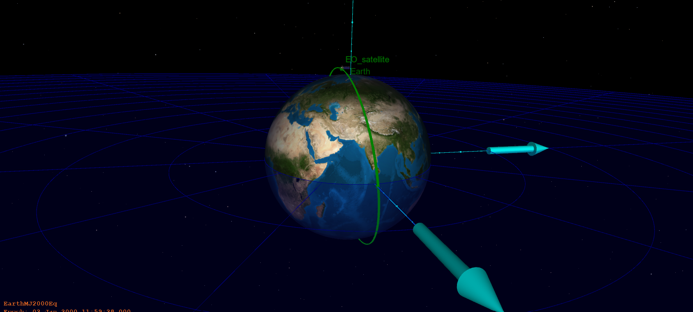

# Basic LEO Orbit using GMAT 

My first project using NASA's General Mission Analysis Tool (GMAT).

In this project, I created a simple satellite mission and simulated a satellite in Low Earth Orbit around Earth.

## Simulation

## Mission Setup

The spacecraft was placed in a near-circular Low Earth Orbit and propagated around Earth.

- Spacecraft: `EO_satellite`
- Orbit type: Low Earth Orbit (LEO)
- Propagation duration: 24 hours
- Central body: Earth
- Propagator: RungeKutta89

## What I Learned

Through this project, I learned some of the basics of GMAT:

- Creating a spacecraft
- Setting orbital parameters
- Using a propagator
- Running a mission sequence
- Setting stopping conditions
- Visualizing a satellite orbit

## Files

- `Basic-LEO-Orbit-GMAT.script` — GMAT mission script
- `orbit-simulation.png` — Simulation result

This is my first project while learning satellite mission analysis using GMAT.
Next, I want to explore orbital perturbations and see how different force models affect a satellite's orbit. 
